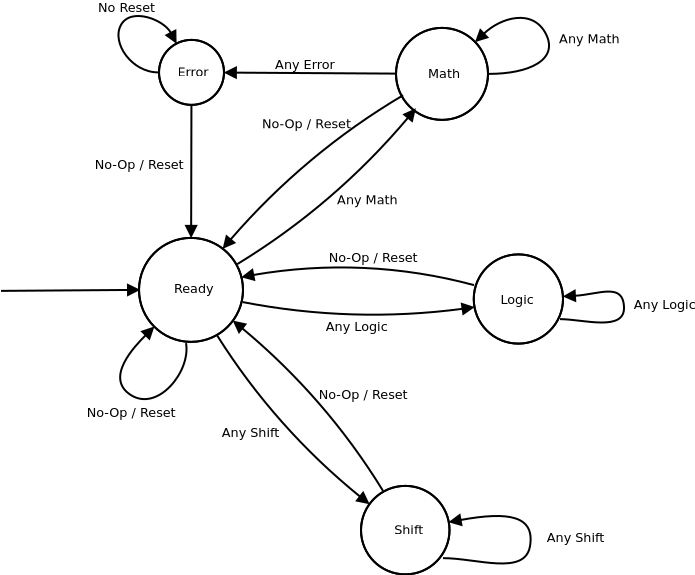
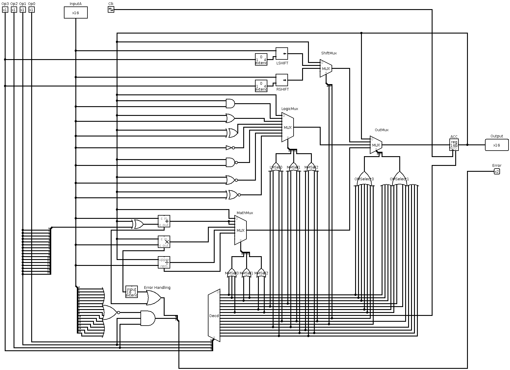

# SimpleALU  

## Description

An ALU designed and written for a Digital Logic class

## Prerequisites

- [Icarus Verilog](https://www.archlinux.org/packages/community/x86_64/iverilog/)  
- [Logisim](https://sourceforge.net/projects/circuit/)  
- [Dia](https://sourceforge.net/projects/dia-installer/)  

## Verilog Usage

Please consult and use `Makefile` for building program  

-`make build` compiles all verilog in `/src` into a single binary in `/bin`  
-`make run` runs the binary  
-`make clean` cleans the `/bin` directory  

## Design

All operations in the ALU could be broken down into three operation types.
Refer to `/doc/ModesOfOperationAndOpcodes.txt`  

Multiplexers were ideal for organizing operations. One was used for each operation type and one final one was used to select the operation type multiplexer output.

